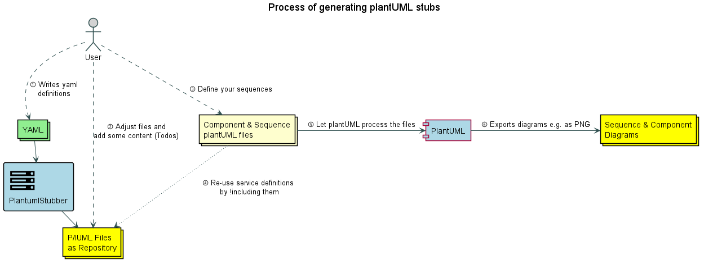
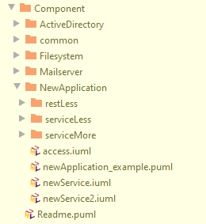
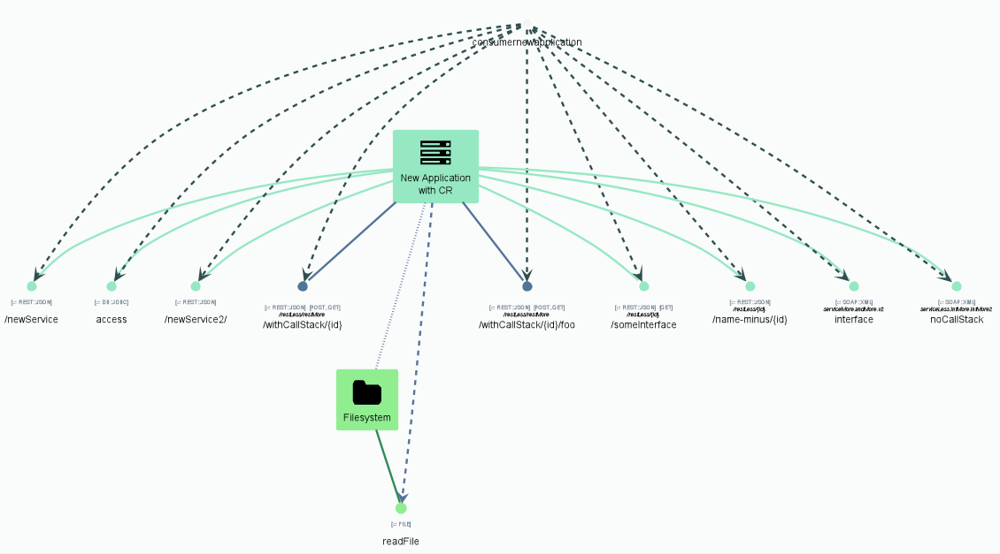
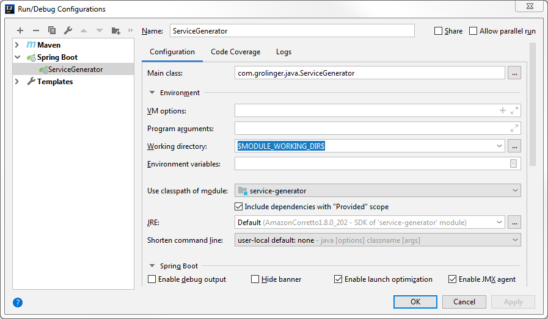

# PlantUMLStubber for generating plantUML application/service stubs

This project is a spring-boot application that generates plantUML stubs for component diagrams and sequence diagrams. Those stubs contain information about applications and services. The generated files can be used to build a repository of re-usable files that come in handy to discuss software architecture or to document an application, a service or how application are working together.

## What?
The stubber will use _yaml_ files, which contain certain information, to generate files in the _target/_ directory. These resulting files are either puml or iuml files. The iuml files contain "todo" marker that are supposed to be filled in with information. 

This works like this. First you write the yaml files and let them process by this application. The result are plantuml files in the folder "Component" or "Sequence". These files need to be finished by filling out the marked TODOs with according details. Over the time you will build a repository of plantuml files of application/services. 



As a next step you may want to define your plantUML files, e.g. to show how an application embeds into the environment. You can reuse the generated services from your repository and use the files by including them into your current file. Then you let plantUML process your file and plantUML will do its magic. The result are the plantUML diagrams.

## Basic notation
That is how I differentiate:

*.iuml are files that can be included and contain a re-usable service definition. Use them with the directive !include
*.puml are plantUML files that are self-sufficient and should not be !included in other files. These files, however, may include .iuml files

This maybe your understanding as well, but the stubber will mostly generate .iuml files. The example.puml files give a hint how one can use the generated stubs.

### YAML configuration
To generate stubs PlantUMLStubber needs yaml files that contains some information, such as name of the application, the domain, what kind of interfaces this application provides.

There is an example file that shows how a yaml file needs to be configured. Use _template_newApplication.yaml as starting point. There is also a rest route available to copy the template to the target folder.
The PlantUMLStubber will consider all yaml files in the target/ folder.

#### Separating names by . and /
PlantUMLStubber treats the characters slash ("/") and dot (".") as separator in the applicationName, service or interface. It will create subdirectories subsequently. In general, PlantUMLStubber removes a lot of special characters due to the fact how plantuml will treat special characters. For example, if you take the variables _$part1_part2_ vs. _$part3+part4_, the first variable will work within plantUML and the latter not, as plantUML will recognize _$part3_ as variable and _+part4_ as a second word. PlantUML will show a syntax error.   

Taking the following example: 
```
applicationName: part1/part2
...
   REST::JSON:
        /api/v2/: 
            - resource
```
Will lead to the following directory and file structure:
```
$ tree
.
└── part1
   └── part2
       └── api
           └── v2
               └── resource.iuml
```
Within the generated iuml file the !procedure has the name: $Part1_part2_api_v2_resource(). As you may notice, the application replaces the character "/" or "." by "_". This is due to the fact how plantUML will treat different special characters as mentioned above.  


#### Auto-Linking two applications
Sometimes it can be useful to draw a link between two applications or an application and its database. This can be done on the configuration yaml by fill in these two configuration keys:
```
linkToComponent: ApplicationName
linkToCustomAlias: applicationalias
```

#### Call Stacks
The configuration yaml enables call stacks, meaning the generated stubs contain already the !includes and $function calls to the other application given in the call stack. 
Example:
```
...
   REST::JSON:
        /api/: 
            - convert->ApplicationName_ServiceName_InterfaceName
```

The Rest::JSON Interface /api/convert will call subsequently application with the Name ApplicationName. This application itself needs to provide this interface. There should be a configuration yaml for the application ApplicationName as well.

As the call stack definition suits to cases first to generate include-path for the files and second to generate the !procedure call for the just included file, this application cannot differentiate between e.g. rest interfaces /api/rest-interface and /api/rest/interface. PlantUMLStubber uses latter , so the application handles all special characters that may produce problems as "/". Please be aware of that.   

#### Domain of Interfaces
Although an application should reside within a single domain it might be necessary to assign a different domain (color) to an interface. You may do so with specifying a domain within the interface definition. Just ad a domain surrounded by <<>>, e.g. <<customer>> that will override the domain of the application.
```
   REST::JSON:
        /api/: 
            - /interface<<authentifizierung>>
```

#### HTTP Methods
For Rest interfaces it might be interesting to specify the supported HTTP methods. The definition must be added in the interface by starting "::" and separating the single methods by ":", as you can see in the example below for ::POST:GET
```
   REST::JSON:
        /api/: 
            - /interface::POST:GET
```

#### Combining interface specifications
Domain of Interfaces, HTTP Methods and Call Stacks can be combined into one specification like below.
```
   REST::JSON:
        /api/: 
            - /interface<<authentifizierung>>::POST:GET->App_Service_interface
            - /interface->App_Service_secondInt::POST:GET<<authentifizierung>>
```
The order does not matter.

#### Note for interfaces with the same name
If an application has e.g. two service implementations (especially "EMPTY") and both have the same interfaceName, the last one wins. E.g. you have a soap service _getVersion()_ and a rest service _/getVersion_ without any additional (service) path, the last definition will override the preceding.
```
...
SOAP:
    EMPTY: [getVersion]
REST
    EMPTY: [/getVersion]
...
```


## Swagger UI and Output
The generator provides a swagger ui on http://localhost:19191/swagger-ui.html#/

### Output

You can generate two types of diagrams:
* **Component**: Services as component diagrams, that may be used for system context diagrams (Kontextdiagramm). This diagram consists of building blocks that describe how systems interact with each other and what is in scope of an implementation and what not.

* **Sequence**: A number of sequence diagrams that are useful as addition to system context diagrams. In later stages of architectural specifications these are helpful to show how systems interact.

#### Example
Using the _template_newApplication.yaml without modifying it would generate in the root folder "Component", for instance the following folders.  


Please note that there are a number of other sub-folders as well, such as email server and file system. For those are yaml files packaged in the project as well.

Stepping down into the folder NewApplication (generated from the template), you will find a newApplication_example.puml. This file will use plantUML to generate the following image.


## Building your own repository
Over the time more and more application fill up a repository and are available for reuse. I usually have one subfolder where I keep those re-usable files (e.g. _includes_) and a second subfolder (e.g. _documentation_) where I keep my files for the specific use case.

Files from the _documentation_ folder may !include files from the _include_ folder, but you may want to prevent to !include within the folder. 
Files in the _include_ folder may !include each other, but should never !include files from the _documentation_ folder.

```
$ tree
.
├── documentation
│   └──  use case 1
│       ├── use case 1.1.puml
│       └── use case 1.2.puml
└── includes
    ├── Application 1
        └── Service 1
            └── interface1.iuml
    ├── Application 2
    └──  etc...
```

## Requirements for using the PlantUML stubs
* The generated files from the repository need a plantUML version >= 1.2019.6 because it uses the new V2 preprocessor or >= 1.2020.7 if you choose the newer version in the swagger ui
* PlantUML itself requires a graphviz 2.38 installation
* The common files may need some manual clean up if you go with the old version of plantUML due to the fact that they introduced procedures in 1.2020.7 that helps with the backwards compatibility but made my life a bit more difficult 

## Intellij Configuration

You need to configure the working directory  (Java `user.dir`) in Run/Debug of the `PlantUMLStubber` 
(formerly known as`ServiceGenerator`) to the root directory of the module so that the service 
configuration yaml can be found, 
e.g. `$MODULE_WORKING_DIR$` in Intellij: 

## Future Plans
* The support of plantuml version prior to 1.2020.7 will be dropped soon from this application, as the old way of functions is not really working. I use the new version exclusively and as far as I know I am the only one so...

_last update 08.08.2020_
