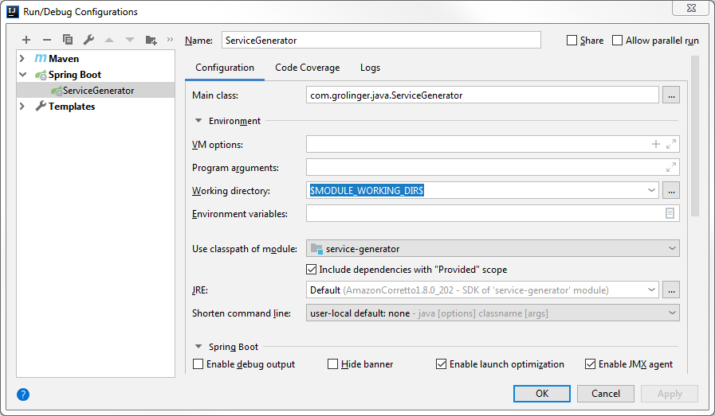

# PlantUMLStubber for Generating PlantUML Repositories

This project can be used to generate stubs for component diagrams and sequence diagrams.
The generator provides a swagger ui on http://localhost:19191/swagger-ui.html#/
The stubber will generate files in the target/ directory. These files are either puml or iuml files. The iuml-files contain "todo" marker that are supposed to be filled in by you.

### Basic notation

That is how I do it:

*.iuml are includible files that contain a re-usable service definition and may be used with !include
*.puml are plantuml files that are self-sufficient and should not be !included in other files. These files, however, may include .iuml files

This maybe your understanding as well or not, but the stubber will mostly generate .iuml files. 

## YAML configuration

There is an example file that shows how a yaml file needs to be configured.
Use _template_newApplication.yaml as starting point and copy it.

## Intellij Configuration

You need to configure the working directory  (Java `user.dir`) in Run/Debug of the `PlantUMLStubber` 
(formerly known as`ServiceGenerator`) to the root directory of the module so that the service 
configuration yaml can be found, 
e.g. `$MODULE_WORKING_DIR$` in Intellij: 

## Todo
